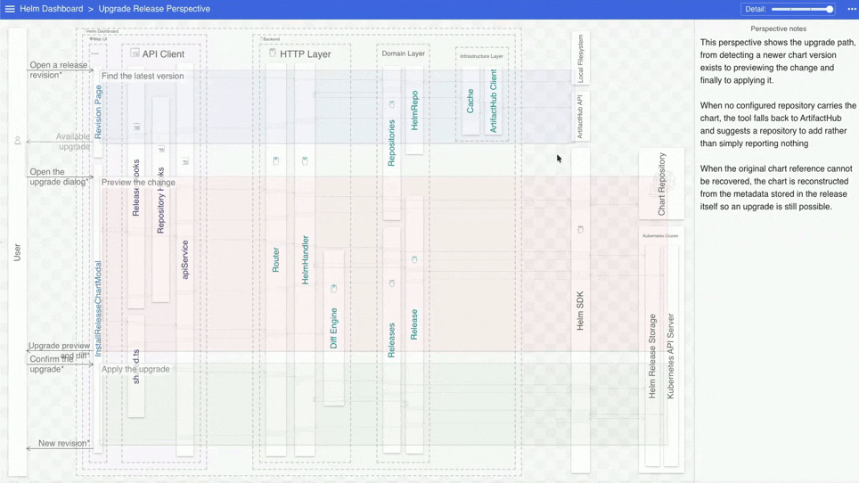
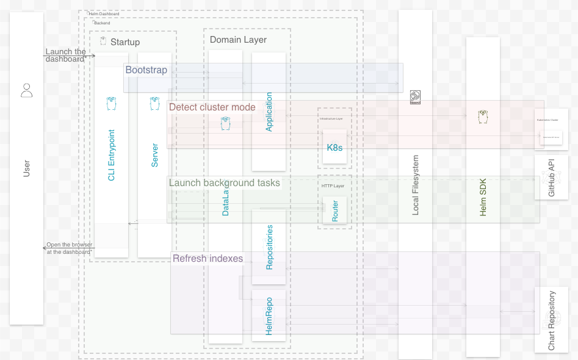
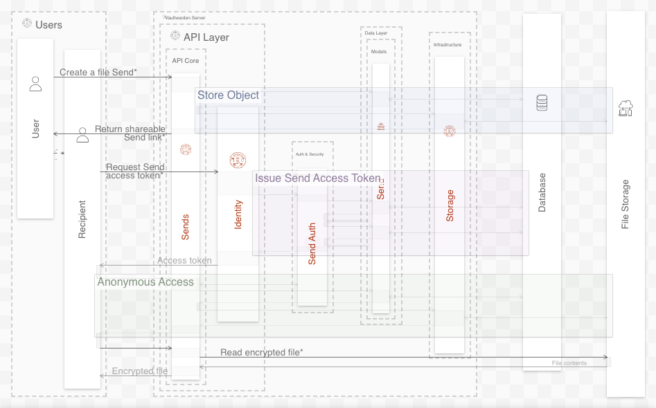
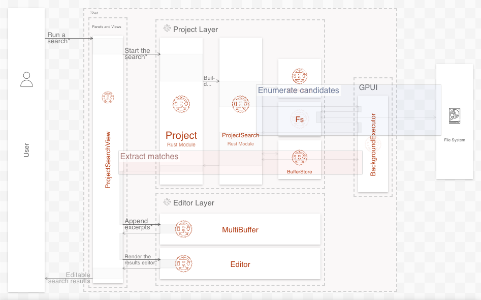

<div align="center">
    
    <p style="font-size: 18px"><strong>Create detailed, auditable, and interactive sequence diagrams of a codebase in minutes</strong></p>
    
    <p><em>Browsing a sequence and following a code citation link to GitHub</em></p>
    <p><strong><a href="#installation">Installation</a> · <a href="#usage">Usage</a> · <a href="#examples">Examples</a> · <a href="#why-ilograph">Why Ilograph</a> · <a href="#discussion">Discussion</a></strong></p>
</div>

This repository contains [agent skills](https://agentskills.io/specification) for creating detailed, auditable, and interactive [Ilograph](https://www.ilograph.com) sequence diagrams of a codebase.

## Installation

<details>
<summary><strong>Claude Code</strong></summary>

First, add the marketplace:

```
/plugin marketplace add ilograph/skills
```

Then install the plugin from it:

```
/plugin install ilograph-skills
```
</details>
<details>
<summary><strong>Any agent with the <a href="https://skills.sh">skills CLI</a></strong></summary>
<br>

```
npx skills add ilograph/skills
```
</details>

## Usage

### Creating diagrams of a codebase

Open a code repository and run

```
/generate-ilograph
```

After analyzing the codebase, the agent will prompt you to choose which system flows to diagram. The number of suggested flows will vary with the size and complexity of the codebase.

Once complete, your Ilograph diagrams will be written to `ilograph.yaml`. Paste the contents of this file as a new diagram into the [Ilograph web app](https://app.ilograph.com/new/) (online version), [Ilograph for Desktop](https://www.ilograph.com/desktop/) (offline version), or [Ilograph for Confluence Cloud](https://marketplace.atlassian.com/apps/1229877/ilograph-interactive-diagrams-for-confluence?tab=overview&hosting=cloud).

### Updating existing diagrams

To keep diagram content and code references in sync with the codebase, run

```
/update-ilograph
```

This will update the `ilograph.yaml` file in place.

## Examples

<table width="100%">
    <tr>
        <td width="33%"><a href="https://app.ilograph.com/demo.ilograph.Helm%2520Dashboard/"></a></td>
        <td width="33%"><a href="https://app.ilograph.com/demo.ilograph.Vaultwarden/"></a></td>
        <td width="33%"><a href="https://app.ilograph.com/demo.ilograph.Zed/"></a></td>
    </tr>
    <tr>
        <td align="center" width="33%"><a href="https://app.ilograph.com/demo.ilograph.Helm%2520Dashboard/"><strong style="font-size: 18px">Helm Dashboard</strong></a></td>
        <td align="center" width="33%"><a href="https://app.ilograph.com/demo.ilograph.Vaultwarden/"><strong style="font-size: 18px">Vaultwarden</strong></a></td>
        <td align="center" width="33%"><a href="https://app.ilograph.com/demo.ilograph.Zed/"><strong style="font-size: 18px">Zed</strong></a></td>
    </tr>
</table>

## Why Ilograph

### Interactivity & Detail
Ilograph diagrams are interactive and zoomable, allowing coding agents to include far more detail than is possible with static, image-based diagrams.

### Auditability
Steps in the flows generated with these skills include code references to specific lines in the codebase, ensuring that each flow can be audited for accuracy.

### Scalability
Sequence flows in Ilograph diagrams can be nested, meaning there is practically no limit to how large and detailed they can be.

### Stability
Ilograph diagrams are defined in a declarative syntax (YAML), allowing both humans and agents to iterate on existing diagrams instead of re-creating them from scratch when a codebase changes.

## Discussion

Please join the [Ilograph Discussion on GitHub](https://github.com/orgs/ilograph/discussions) to share feedback and ideas.